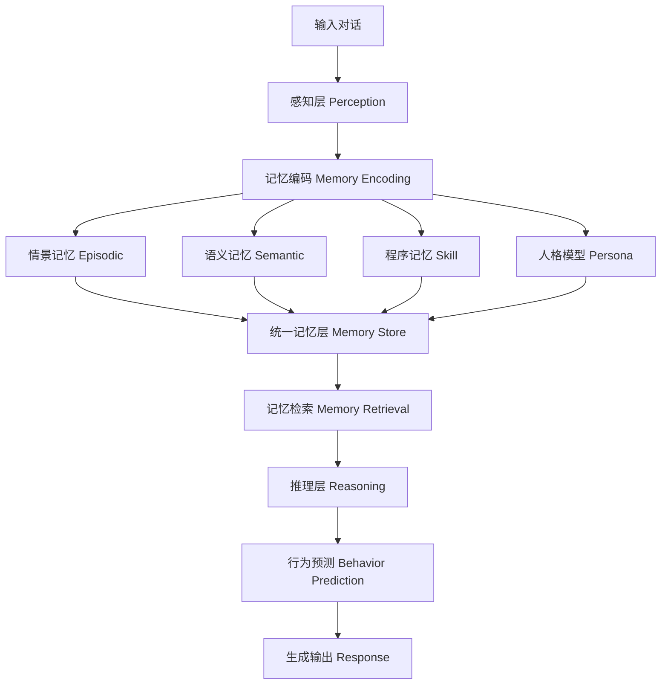
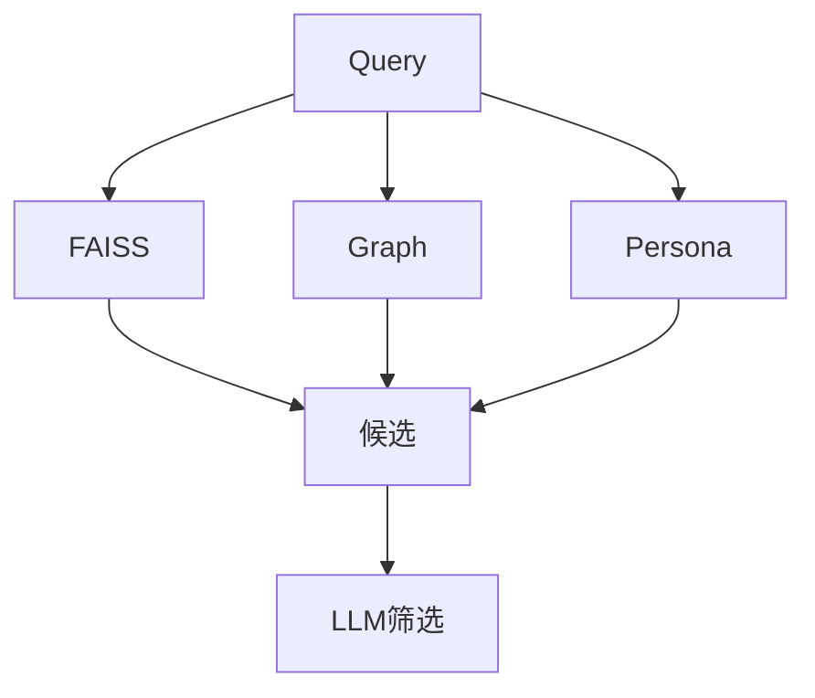

# 🧠 类人级 Memory System（Human-like Memory System）
## 📄 Product Requirement Document (PRD)

---

# 1. 背景与目标

## 1.1 背景

当前 AI Agent 存在核心问题：

- ❌ 记忆是“文本堆积”，不是结构化理解  
- ❌ 无法长期建模人物（用户 / 多人关系）  
- ❌ 无法预测行为（只是被动回答）  

而人类：

✅ 能长期记住人  
✅ 会自动建“社会关系模型”  
✅ 可以预测别人行为（Theory of Mind）  

---

## 1.2 产品目标

构建一个 **类人级 Memory System**：

### 🎯 核心能力

1. ✅ 持续构建“世界模型”（World Model）
2. ✅ 长期记住“人 + 关系 + 偏好 +行为模式”
3. ✅ 支持“理解人”
4. ✅ 支持“预测行为”
5. ✅ 支持“自进化记忆”

---

# 2. 总体架构

---

# 3. 人类记忆 → Agent 映射

| 人类系统 | Agent实现 |
|--------|---------|
| 感觉记忆 | 输入 buffer |
| 工作记忆 | Prompt / context |
| 情景记忆 | FAISS / vector DB |
| 语义记忆 | Knowledge Graph |
| 程序记忆 | Skills |
| 人格模型 | Persona DB |

---

# 4. 模块设计

## 4.1 感知层（Perception Layer）

### ✅ 功能

- 输入解析（聊天 / 文本）
- 多人识别（speaker detection）
- 实体识别（NER）

---

## 4.2 记忆编码层（Memory Encoding Layer）

### ✅ 功能

将输入转成结构化知识：

- 人物抽取（Entity Extraction）
- 属性抽取（Traits）
- 关系抽取（Relations）
- 行为模式识别（Behavior Pattern）

---

## 4.3 记忆系统（Memory Store）

### 🧠 多层 Memory 设计

- 情景记忆（FAISS / Vector DB）
- 语义记忆（Graph DB）
- 程序记忆（Skills）
- 人格模型（Persona）

---

# 5. 记忆更新机制（Self-evolution）

- 重复出现
- 情绪强烈
- 与任务相关

更新策略：
- Replace
- Merge
- Weight

---

# 6. 记忆检索机制

---

# 7. 行为预测模块

输入：context + persona  
输出：action prediction

---

# 8. 推理层

输入：当前问题 + memory context  
输出：带人物理解的答案

---

# 9. 数据与训练

- 小模型：文本 → 结构化知识（LoRA）  
- 行为模型：persona → action

---

# 10. 系统特性

- 长期记忆  
- 自进化  
- 可解释  
- 类人行为  

---

# 11. MVP阶段

- Phase1：Graph + FAISS
- Phase2：Persona
- Phase3：Behavior Prediction

---

# 12. 成功指标

- recall accuracy
- entity accuracy
- prediction accuracy

---

# 13. 总结

> 从对话沉淀“人+关系+行为模型”，让 Agent 具备理解人与预测行为能力。
